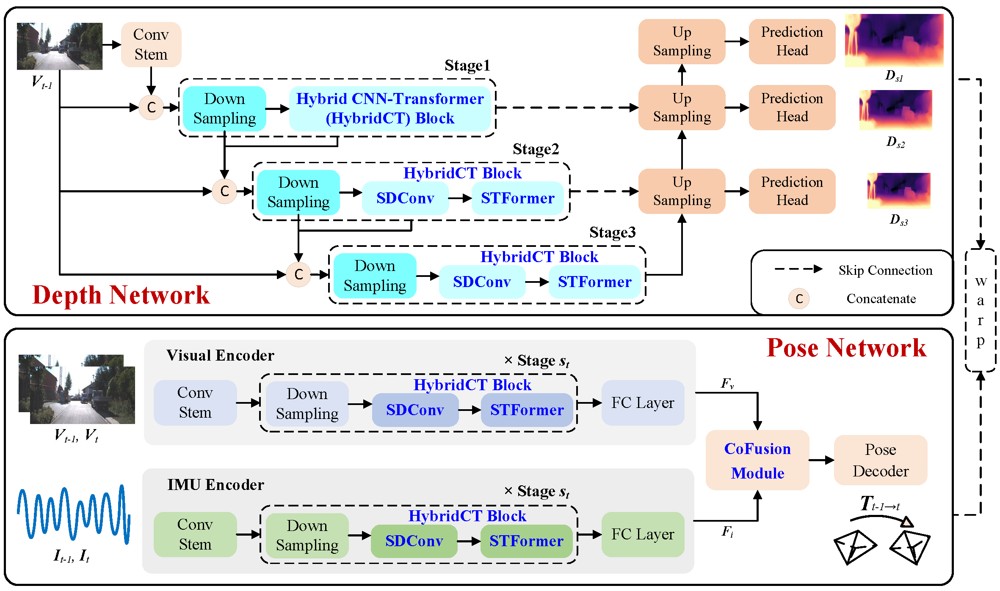

  
# Bot-VIO
**BotVIO: A Lightweight Transformer-Based Visual-Inertial Odometry for Robotics**

  Wenhui Wei, Yangfan Zhou, Yimin Hu, Zhi Li, Sen Wang,  Xin Liu, Jiadong Li
  

## Overview

## Table of Contents
- [Setup](#setup)
- [Data Preparation](#data-preparation)
- [Download Pretrainined Models](#download-pretrainined-models)
- [Evaluation](#evaluation)
  - [Pose Results and Visualization](#pose-results)
  - [Pose Evaluation](#pose-evaluation)
  - [Depth Evaluation](#depth-evaluation)
  - [Running Time Evaluation](#running-time-evaluation)

# Setup
- Create conda environment
- Install torch==1.12.1, torchvision==0.13.1, timm==0.4.12

## Data Preparation
Please refer to [Visual-Selective-VIO](https://github.com/mingyuyng/Visual-Selective-VIO) to prepare your data. 

## Download Pretrainined Models
Please download [pretrained models](https://drive.google.com/drive/folders/1D-CpdPKyOwRMFlU-sp0dhslvIBmx9oxf?usp=drive_link) and place them under pretrain_models directory.

## Evaluation
### Pose Results
    python ./evaluation/eval_odom.py
    
### Pose Evaluation
    python ./evaluation/evaluate_pose_vo.py
    Please modify '--data_path' in the options.py file to specify your dataset path. Additionally, update the pose embedding data type to float16 in PositionalEncodingFourier function within the depth encoder.py file.  In addtion, comment out the fully connected (FC) layer in the pose_encoder.py.
    
    python ./evaluation/evaluate_pose_vio.py
    Please modify '--data_path' in the options.py file to specify your dataset path. Additionally, update the pose embedding data type to float16 in PositionalEncodingFourier function within the depth encoder.py file.

### Depth Evaluation
    python ./evaluation/evaluate_depth.py
    Please modify '--data_path' in the options.py file to specify your dataset path, and  comment out the IMU data reading process in the in the mono_dataset.py file.
    
### Running Time Evaluation
    python ./evaluation/evaluate_timing.py
    Please modify '--data_path' in the options.py file to specify your dataset path. Additionally, update the pose embedding data type to float16 in PositionalEncodingFourier function within the depth encoder.py file.

### Citation
The manuscript related to this work is currently under review.

### Reference
[1] [Lite-Mono](https://github.com/noahzn/Lite-Mono), [2] [ViTA](https://github.com/KexianHust/ViTA)
