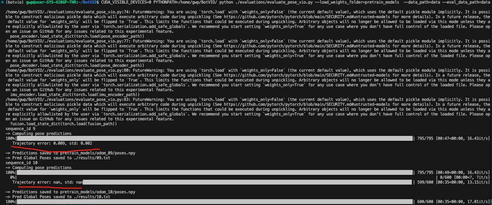

<div align="center">
<h1>测试 BotVIO: A Lightweight Transformer-Based Visual-Inertial Odometry for Robotics</h1>
</div>


## 配置测试

```sh
git clone https://github.com/R-C-Group/BotVIO.git  --recursive

conda create -n botvio python=3.10
conda activate botvio

conda install pytorch torchvision torchaudio pytorch-cuda=12.1 -c pytorch -c nvidia
pip install timm==0.4.12
pip install matplotlib
pip install gdown
pip install scipy
pip install scikit-image
pip install einops
pip install opencv-python
```

Data Preparation:采用KITTI数据集(注意要留有空间)

```sh
cd data
source data_prep.sh 
```

然后下载预训练模型[link](https://drive.google.com/drive/folders/1D-CpdPKyOwRMFlU-sp0dhslvIBmx9oxf?usp=drive_link),并且放在`pretrain_models`路径下

~~~
cd ./pretrain_models
python download.py
~~~

计算pose的结果：

```sh
conda activate botvio

python ./evaluations/eval_odom.py #这句运行需要创建一个results文件，并且运行了没有任何结果输出～～～

# CUDA_VISIBLE_DEVICES=0 PYTHONPATH=/home/gwp/BotVIO/ python ./evaluations/evaluate_pose_vo.py --load_weights_folder=pretrain_models  --data_path=data
# Please modify '--data_path' in the options.py file to specify your dataset path. 
# Additionally, update the pose embedding data type to float16 in PositionalEncodingFourier function within the depth encoder.py file.  
# In addtion, comment out the fully connected (FC) layer in the pose_encoder.py.
# 注意vio中有一个额外的全链接层，如果运行vo的时候要注释

#需要先创建空的文件夹results
CUDA_VISIBLE_DEVICES=0 PYTHONPATH=/home/gwp/BotVIO/ python ./evaluations/evaluate_pose_vio.py --load_weights_folder=pretrain_models  --data_path=data --eval_data_path=data
# Please modify '--data_path' in the options.py file to specify your dataset path. Additionally, update the pose embedding data type to float16 in PositionalEncodingFourier function within the depth encoder.py file.
```

运行效果结果：

<div align="center">
  
<figcaption>  
</figcaption>
</div>
